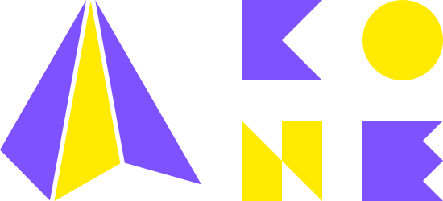

    

 

# Kone &ndash; library for pure mathematical experiments

Kone (pronounced the same way as "cone") is a library that implements common algorithms to simplify your experience of mathematical experiments.

<!--
## Kone's priorities

In the project, there is priority of tasks:
1. Any algorithm should not be optimised before it is finally implemented.
2. JVM platform is prioritised much higher than other platforms.
-->

<!--
## Getting Started

TODO
-->

## Documentation

Visit Kone's [docs](https://lounres.dev/Kone/docs/) and [API reference](https://lounres.dev/Kone/api/) sites.
